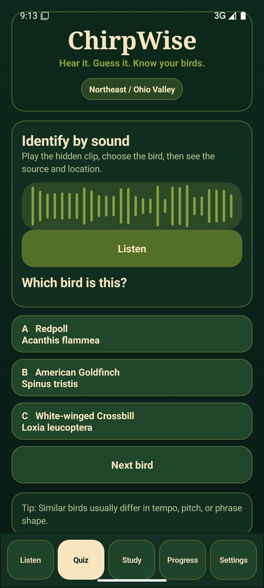

# ChirpWise

ChirpWise is an offline bird-sound trainer for Android and desktop preview workflows. It lets a birder quickly search a species, play a real field recording, study the local sound library, and practice with a quiz that tracks weak birds over time.



## What It Demonstrates

This project is built as a production-shaped portfolio piece, not a static demo. It covers:

- Native Android UI built around fast field use: Listen, Quiz, Study, Progress, and Settings.
- Real Xeno-canto bird recordings bundled into a local Northeast / Ohio Valley training pack.
- License-aware ingestion that preserves recordist, source URL, Creative Commons license, and attribution for every clip.
- A repeatable data pipeline for taxonomy import, Xeno-canto metadata search, audio download, 20-second clip generation, regional pack assembly, and coverage reporting.
- Local progress tracking by species, including known birds, weak birds, unseen birds, recent birds, and streak.
- Desktop preview support through an Android emulator so UI changes are tested against the same APK a user installs.

## Product Shape

The product spine is:

```text
taxonomy -> audio acquisition -> license tracking -> normalized library -> mobile UI -> quiz engine
```

The current Android build ships the `Northeast / Ohio Valley` pack:

- 316 regional species
- 346 real 20-second Xeno-canto clips
- Offline playback
- Android 6.0+ support
- Self-contained APK

Generated datasets, API keys, build tools, signing keys, raw recordings, and APK outputs are kept out of Git. The repository tracks the source, build scripts, documentation, and screenshots.

## Try It On This Computer

The closest computer preview is the actual APK running in the Android emulator:

```powershell
.\tools\run_android_preview.ps1
```

That script starts the `ChirpWise_Preview` virtual phone, installs:

```text
dist/android/ChirpWise-Northeast-v0.2.0.apk
```

and launches ChirpWise. This is the same Android app experience the phone user sees.

## Android Build

```powershell
$base = (Resolve-Path 'tools/android-build').Path
$env:JAVA_HOME = Join-Path $base 'jdk-17'
$env:ANDROID_HOME = Join-Path $base 'android-sdk'
$env:ANDROID_SDK_ROOT = $env:ANDROID_HOME
$env:PATH = "$env:JAVA_HOME/bin;$base/gradle-8.10.2/bin;$env:ANDROID_HOME/platform-tools;$env:ANDROID_HOME/build-tools/35.0.0;$env:PATH"

gradle -p android assembleRelease
```

The release APK is produced at:

```text
android/app/build/outputs/apk/release/app-release.apk
```

## Data Pipeline

The data builder is staged so each part can be audited or rerun:

```powershell
$env:XENO_CANTO_API_KEY = "your-key"
python tools/update_region_membership_from_xeno.py --region northeast
python tools/backfill_region_audio.py --region northeast
python tools/create_training_clips.py --seconds 20 --bitrate 96k
python tools/build_android_assets.py --region northeast --pack-name "Northeast / Ohio Valley" --clean
```

Xeno-canto API v3 requires a registered account and verified email. Do not commit the API key.

## Desktop Local App

The repository also includes the earlier local desktop/browser trainer and SQLite-backed API:

```powershell
python tools/run_app.py
```

Open:

```text
http://127.0.0.1:8765
```

The Android app is now the primary user experience; the desktop app remains useful for data inspection and local library browsing.

## License Hygiene

Every recording row stores:

- `license_name`
- `license_url`
- `recordist`
- `source_url`
- `source_recording_id`
- generated `attribution_text`

The pipeline can skip derivative operations for NoDerivatives licenses and can filter NonCommercial licenses for commercial-safe builds.

## Project Layout

```text
android/              Native Android app
app/                  Desktop browser UI
server/               Local HTTP API
ingest/birdtrainer/   Python ingestion and SQLite package
tools/                Build, launch, audio, Android, and dataset utilities
docs/                 Pipeline notes, region docs, screenshots
tests/                Python unit tests
data/                 Ignored local database/audio/manifests
dist/                 Ignored local APK and desktop builds
```
