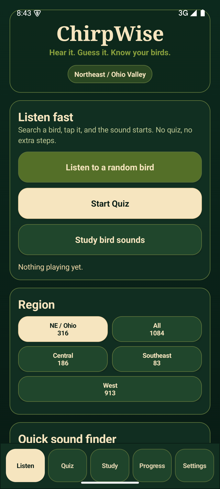
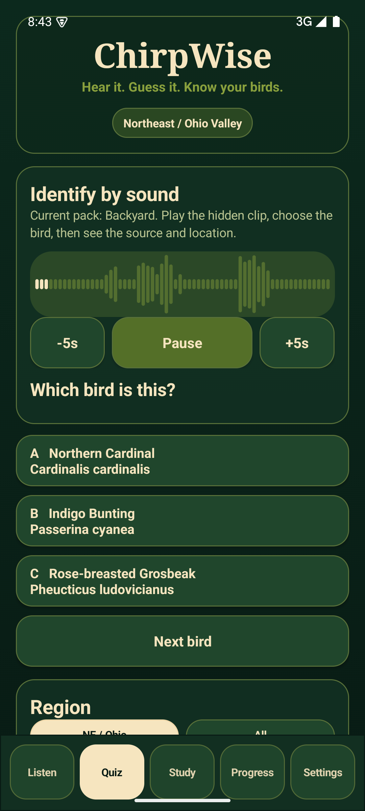
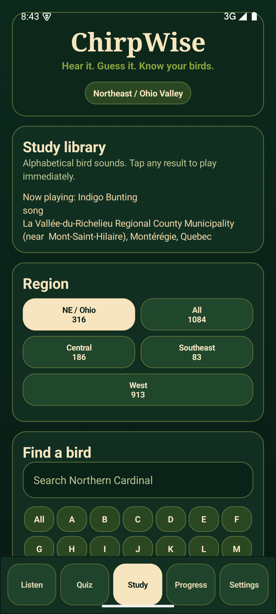
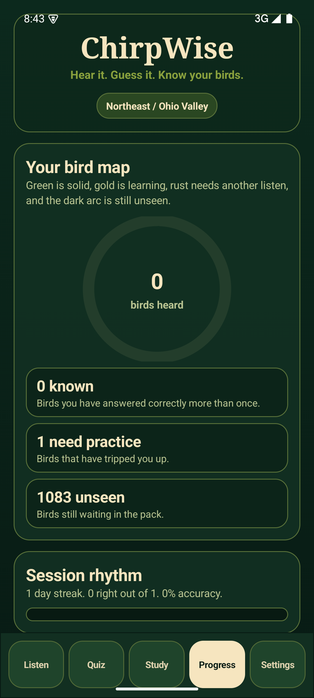
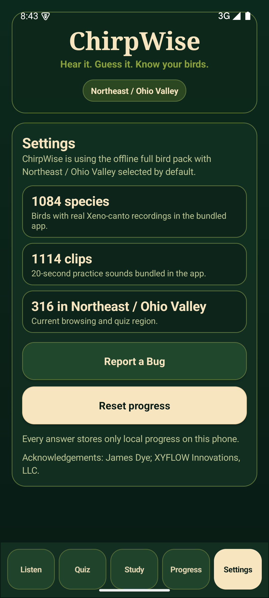

# ChirpWise

ChirpWise is an offline Android bird-sound trainer built for fast field use: hear a real bird recording, guess the species, review misses, and quickly look up a bird sound when someone mentions it.



## What It Does

- Bundles real Xeno-canto recordings for offline playback.
- Starts in the Northeast / Ohio Valley region, with other region tabs available.
- Provides Listen, Quiz, Study, Progress, and Settings screens.
- Lets users search or jump by letter to play a bird sound quickly.
- Runs 3-choice sound quizzes with live waveform playback, pause/play, and five-second seeking.
- Tracks local progress by species, including known birds, weak birds, unseen birds, recent birds, and streak.
- Supports focused practice packs and custom quiz sets.
- Shows source, recordist, license, and trim/change attribution after quiz answers.
- Opens a prefilled bug-report email from Settings.

## Android Release Profile

The current Android build profile is:

- Android 6.0+ / API 23+
- 1,084 bird species with real recordings
- 1,114 real 20-second Xeno-canto clips
- 316 Northeast / Ohio Valley species in the default region
- 1,084 species available from the All birds tab
- Self-contained offline APK; no server, Python, Xeno-canto key, or internet required at runtime
- SHA256: `E2387BBBA28139857AE358EE14197529ACD153654D0A5D02B345DDF26705D71D`

Generated APKs, audio assets, API keys, signing keys, and local build tools are intentionally excluded from Git.

## Commercial Status

ChirpWise is a working personal/non-commercial app and portfolio artifact. The
source code is MIT licensed, but the bird recordings are not. Audio assets remain
under their original source licenses and are excluded from this repository. A
paid or broadly distributed public build requires a commercial-safe replacement
audio pack, direct recordist permission, or another reviewed licensing path.

See [AUDIO_LICENSE_NOTICE.md](AUDIO_LICENSE_NOTICE.md) and
[docs/licensing.md](docs/licensing.md) for the current licensing posture.

## Screenshots

| Listen | Quiz |
| --- | --- |
|  |  |

| Study | Progress |
| --- | --- |
|  |  |

| Settings |
| --- |
|  |

## Development

Build the Android app locally:

```powershell
$base = (Resolve-Path 'tools/android-build').Path
$env:JAVA_HOME = Join-Path $base 'jdk-17'
$env:ANDROID_HOME = Join-Path $base 'android-sdk'
$env:ANDROID_SDK_ROOT = $env:ANDROID_HOME
$env:PATH = "$env:JAVA_HOME/bin;$base/gradle-8.10.2/bin;$env:ANDROID_HOME/platform-tools;$env:ANDROID_HOME/build-tools/35.0.0;$env:PATH"

gradle -p android assembleRelease
```

The Gradle output is:

```text
android/app/build/outputs/apk/release/app-release.apk
```

For emulator-based QA of the generated release package:

```powershell
.\tools\run_android_preview.ps1
```

## Data Pipeline

The data builder is staged so every part can be audited or rerun:

```powershell
$env:XENO_CANTO_API_KEY = "your-key"
python tools/update_region_membership_from_xeno.py --region northeast
python tools/backfill_region_audio.py --region northeast
python tools/create_training_clips.py --seconds 20 --bitrate 96k
python tools/build_android_assets.py --region all --pack-name "Full bird pack / Northeast focus" --clean
python tools/license_audit.py
python tools/commercial_source_coverage.py
```

API keys, raw recordings, generated app assets, signing keys, build tools, and APK outputs are intentionally ignored by Git.

## License Hygiene

ChirpWise treats license metadata as product data. Every recording stores:

- `license_name`
- `license_url`
- `recordist`
- `source_url`
- `source_recording_id`
- generated `attribution_text`

Current paid-app audit for the existing free/private audio pack:

- 20 clips are app-safe for a paid trimmed build.
- 1,094 clips need replacement audio or recordist permission before a paid release.
- Row-by-row audit: `docs/audits/commercial-license-audit.csv`

Current no-email replacement-source map for the 1,161-species North America taxonomy:

- 626 species have strict commercial-safe coverage from Xeno-canto, NPS, or Wikimedia Commons.
- 804 species have coverage if iNaturalist research-grade candidates are accepted after manual listening QC.
- 357 species remain missing.
- Row-by-row map: `docs/audits/commercial-source-coverage.csv`

A paid public build should use the commercial-safe replacement pipeline.

## Project Layout

```text
android/              Native Android app
app/                  Earlier desktop browser UI
server/               Local HTTP API for desktop preview
ingest/birdtrainer/   Python ingestion and SQLite package
tools/                Build, launch, audio, Android, dataset, and audit utilities
docs/                 Pipeline notes, region docs, audits, screenshots
tests/                Python unit tests
data/                 Ignored local database/audio/cache/manifests
dist/                 Ignored local APK and desktop builds
```

## Acknowledgements

Built by James Dye and XYFLOW Innovations, LLC.

Bird recordings are credited per clip in the dataset and app attribution flow. Xeno-canto recordists retain rights to their recordings under the license attached to each source recording.

## License

Source code and project documentation are released under the MIT License. Audio
recordings and generated audio assets are excluded; see
[AUDIO_LICENSE_NOTICE.md](AUDIO_LICENSE_NOTICE.md).
